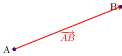
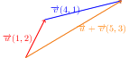

Dados dos puntos en el plano (A y B), podemos trazar una flecha que vaya
del primero al segundo. A esta flecha la llamaremos vector (fijo) y se
denota $\overrightarrow{AB}$.

Dos vectores (fijos) son \textbf{equipolentes} cuando tienen el mismo
módulo, misma dirección y mismo sentido. Un vector fijo y todos sus
equipolentes forman lo que de denomina un \textbf{vector libre}. Se
denota $\overrightarrow{v}$ o $\left[\overrightarrow{AB}\right]$ siendo
$\overrightarrow{AB}$ un vector fijo representante de
$\overrightarrow{v}$. Un vector libre viene determinado por sus
coordenadas:

Un vector se puede ver como el desplazamiento que tenemos que hacer
horizontalmente y verticalmente para ir del origen al extremo del mismo.
Al desplazamiento horizontal le llamaremos primera coordenada y al
vertical, segunda.

Determina las coordenadas y el módulo del vector libre cuyo
representante es el vector que va de $A(1,1)$ a $B(7,5)$

Dado $k \in \mathbb{R}$ y $\overrightarrow{u}$ se define
$k\cdot\overrightarrow{u}$ como un $\overrightarrow{v}$ que:

Además se cumple que si
$\overrightarrow{u}(x_1,y_1)\to k\overrightarrow{u}(k\cdot x_1,k\cdot y_1)$

Dados $\overrightarrow{u}$ y $\overrightarrow{v}$ se define la suma como
el vector que si los ponemos seguidos va del origen del primer vector al
extremo del segundo vector. Además se cumple que si
$\overrightarrow{u}(x_1,y_1) \ y \overrightarrow{v}(x_2,y_2) \to \overrightarrow{u} +\overrightarrow{v}(x_1+x_2, y_1+y_2)$
\medskip 

Dados $\overrightarrow{u}$ y $\overrightarrow{v}$ se define la resta
como la suma del primero con el opuesto del segundo. Además se cumple
que si
$\overrightarrow{u}(x_1,y_1) \ y \overrightarrow{v}(x_2,y_2) \to \overrightarrow{u} -\overrightarrow{v}(x_1-x_2, y_1-y_2)$

Dados dos puntos del plano, $A(x_1,y_1)$ y $B(x_2,y_2)$, el punto medio
es $M(\frac{x_1+x_2}{2},\frac{y_1+y_2}{2})$.

La demostración es sencilla aplicando la propiedad geométrica que cumple
el punto medio: $\overrightarrow{AM}=\overrightarrow{MB}$

Dados los puntos $A$, $B$ y $C$ estarán alineados si los vectores
$\overrightarrow{AB}$ y $\overrightarrow{BC}$ son colineales, o tienen
la misma dirección, y por tanto:
$\exists k\in\mathbb{R} | \ \left[\overrightarrow{BC}\right]=k\cdot\left[\overrightarrow{AB}\right]$

o bien:

Si $\left[\overrightarrow{AB}\right]=\overrightarrow{u}(u1,u2)$ y
$\left[\overrightarrow{BC}\right]=\overrightarrow{v}(v1,v2)$, se cumple:
$$\dfrac{v1}{u1}=\dfrac{v2}{u2}$$

Están alineados porque
$\left[\overrightarrow{BC}\right]=3\cdot\left[\overrightarrow{AB}\right]$,
o bien porque:

$$\dfrac{3}{1}=\dfrac{-1.5}{-0.5}$$

Podemos definir la recta como el lugar geométrico formado por el
conjunto de puntos del plano que a partir de un punto fijo siguen una
misma dirección. Dado un punto $P(x_0,y_0)$ y un vector
$\overrightarrow{d}(v_1,v_2)$, en la recta $r$ se cumple:

$$\overrightarrow{OX}=\overrightarrow{OP}+\overrightarrow{PX} $$

Como $\overrightarrow{PX}$ y $\overrightarrow{d}$ son colineales:

$$\overrightarrow{OX}=\overrightarrow{OP}+\lambda\cdot\overrightarrow{d} $$

Se obtiene a partir de las coordenadas de la expresión anterior :
$$(x,y)=(x_0,y_0)+\lambda\cdot(v_1,v_2)$$

Se obtienen separando cada coordenada del expresión anterior:
$$\left\lbrace \begin{gathered}
  x = x_0 + \lambda\cdot v_1 \hfill \\
  y = y_0 + \lambda\cdot v_2 \hfill \\ 
\end{gathered}  \right.
$$

Se obtienen de la anterior despejando $\lambda$ en cada ecuación e
igualando la expresiones: $$ \dfrac{x-x_0}{v_1}=\dfrac{y-y_0}{v_2}$$

Operando y reduciendo la expresión anterior llegaremos a una de la
forma: $$Ax+By+C=0$$

Despejando la $y$ en la ecuación anterior obtendremos $$y=mx+n$$ donde
$m$ es la pendiente y $n$ la ordenada en el origen

Dada una recta $r$ de pendiente $m$ entonces el vector
$\overrightarrow{v}(1,m)$ es un vector director de la recta. Y al revés,
si $\overrightarrow{d}(v_1,v_2)$ es un vector director de la recta,
entonces $m=\dfrac{v_2}{v_1}$ es la pendiente de la recta

Dada la recta que pasa por $P(1,3)$ y de dirección la marcada por edl
vector $\overrightarrow{d}(3,-1)$ determina la ecuación de la misma en
sus diferentes variantes:

Dado $\overrightarrow{d}(u1,u2)$ y un vector perpendicular del mismo
módulo $\overrightarrow{e}(v1,v2)$:

Se cumple que $\overrightarrow{e}(v1,v2)=(-u2,u1)$ y por tanto:

Dada una circunferencia de centro $P(x_0,y_0)$ y de radio $r$:

Los puntos $X(x,y)$ de la misma cumplen:

$$\left|\overrightarrow{PX}\right|=r $$

Como $\overrightarrow{OP}+\overrightarrow{PX}=\overrightarrow{OX}$,
luego $\overrightarrow{PX}=\overrightarrow{OX}-\overrightarrow{OP}$- Por
tanto:

$$\left|\overrightarrow{OX}-\overrightarrow{OP}\right|=r $$ Pasando a
coordenadas: $$ \left|(x-x_0,y-y_0)\right|=r $$

Y por el teorema de Pitágoras obtenemos la ecuación de la
circunferencia:

$$ (x-x_0)^2+(y-y_0)^2=r^2 $$

Determina la ecuación de la circunferencia con centro $P(3,1)$ y radio
3:

\%expand(Circle(Point(3,1),3).equation())

$$(x-3)^2+(y-1)^2=3^2$$

$$x^2-6x+9+y^2-2y+1=9$$

$$x^2+y^2-6x-2y+1=0$$
