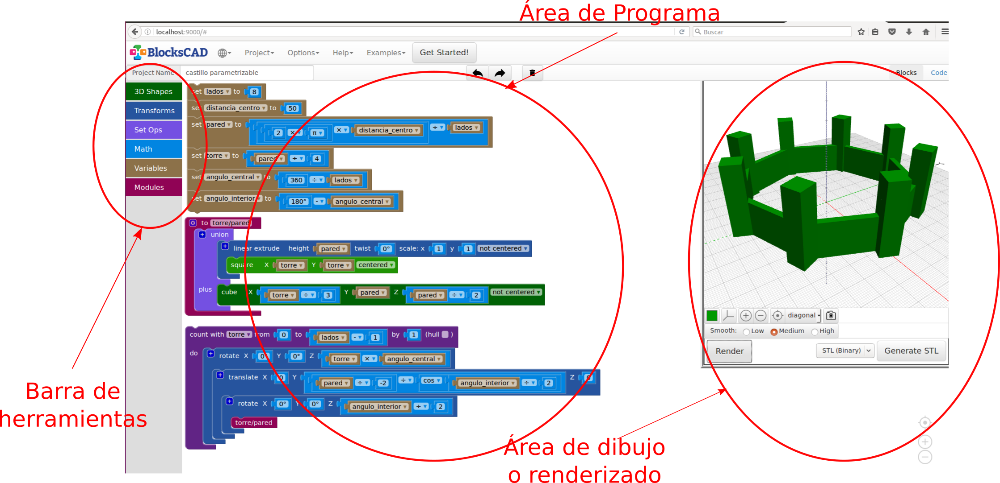
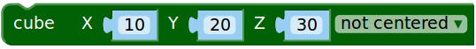
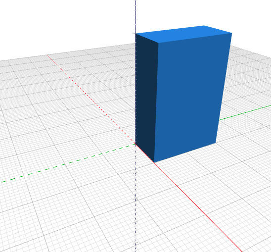
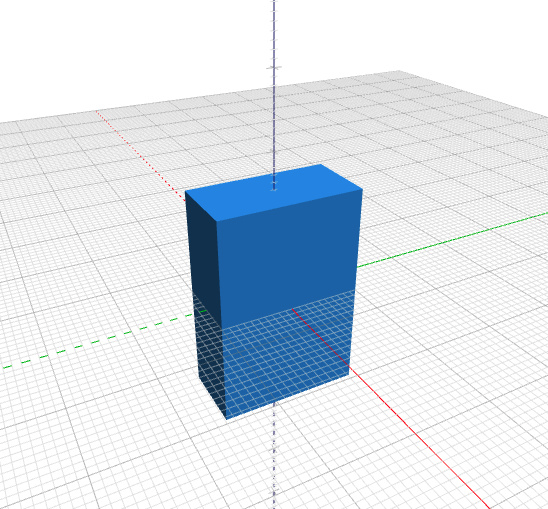
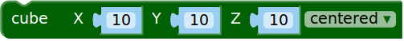
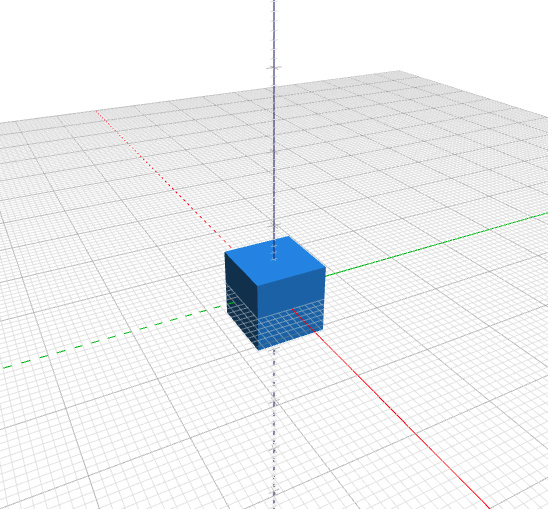

# Tutorial de BlocksCAD:

## Introducción

BlocksCAD no es más que una interfaz web de  [OpenSCAD](http://www.openscad.org) basada en bloques tipo [Scratch](http://scratch.mit.edu). Evidentemente, solo tiene implementados bloques muy básicos, por lo que la funcionalidad es limitada. Sin embargo, el uso de bloques hace que sea una estupenda herramienta para introducir a los niños en el pensamiento computacional, la capacidad espacial y el modelado en 3D.

Podemos acceder via web a [BlocksCAD](https://blockscad.einsteinsworkshop.com/), o bien descargarlo de [github](https://github.com/EinsteinsWorkshop/BlocksCAD) y ejecutarlo localmente o en un servidor dedicado, esto último está bien si no tienes conexión a Internet (más información en el [README](https://github.com/EinsteinsWorkshop/BlocksCAD/blob/development/README) del proyecto):


```sh
cd /path/to/mydir-with-index.html-in-it
python -m SimpleHTTPServer 9000
# Then point your browser to:
# http://localhost:9000/
```

En el momento de la elaboracion de este tutorial, se estaba desarrollando un proyecto similar: [ScratchyCAD](http://scratchycad.com/).

### El entorno

El entorno lo podemos dividir en tres partes:



1. **Área de Programa:** Conjunto de bloques que reprensentan las instrucciones a ejecutar para "renderizar" el modelo 3D. Se arrastran desde la *barra de bloques* y se van encajando unos con otros para determinar la lógica de ejecución-construccion.
2. **Barra de bloques:** Paleta que contiene los bloques que se pueden utilzar en el *área de programa*. Los bloques se arrastran de una zona a otra
* **Área de dibujo o renderizado:** Al darle al botón *render*, el programa ejecuta y renderiza el modelo 3D a partir de los bloque que aparezcan en el *área de programa*.

Además, tenemos la típica **Barra de Herramientas** para manejar los archivos, determinar las preferencias del entorno o acceder a la ayuda del programa.

## Tutoriales
1. **Cubo Hola Mundo**

    En primer lugar, vamos a seleccionar la opción *Simple ToolBox* que aparece dentro del menú *options* de la *barra de menús. De esta forma reducimos las opciones de la **Barra de bloques**. Una vez vayamos conociendo el programa ya nos intereserá la parte avanzada.
    
    Dentro del bloque *3D Shapes*, arrastramos el bloque 
     y lo llevamos a la zona del programa.
    
    El bloque tiene los siguientes campos:
    
    -   Longitud del cubo en el *eje X*, es decir el ancho. **NOTA:** Por defecto el valor indica milímetros, es decir, un valor *10* en este campo nos dará un cubo de *1 cm* de ancho.
    -   Longitud del cubo en el *eje Y*, es decir el largo.
    -   Longitud del cubo en el *eje Z*, es decir el alto.
    -   Un desplegable *not centered* o *centered*. Indica si queremos que un vértice del cubo se apoye en el origen de coordenadas o que el origen de coordenadas se encuentre en el centro del cubo.
    
    **Ejemplos:**
    
    | Bloque |Renderizado |
    | :------: |-----------: |
    | | |
    | | |
    | | |
    
    
    
    | Tables        | Are           | Cool  |
    | ------------- |:-------------:| -----:|
    | col 3 is      | right-aligned | $1600 |
    | col 2 is      | centered      |   $12 |
    | zebra stripes | are neat      |    $1 |
    
    **Ejercicios:**
    
    -
    

* 
* Rotando 

## Autor

    Carlos Rodríguez Jaso

## Licencia

  
[Creative Commons Attribution-ShareAlike 4.0 International License](http://creativecommons.org/licenses/by-sa/4.0/)
