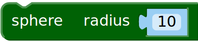
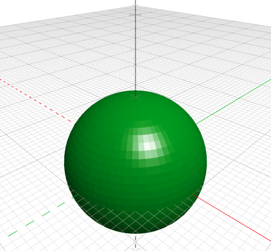
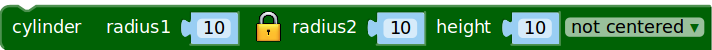
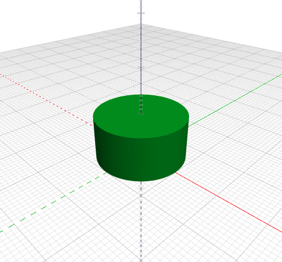
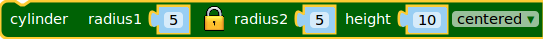
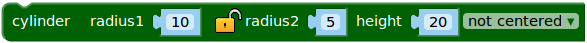
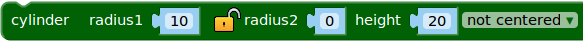
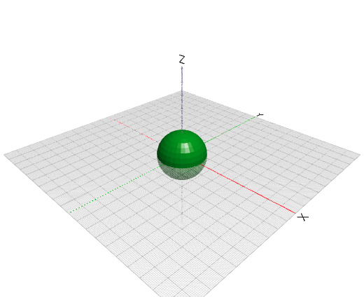

# Tutorial de BlocksCAD:

## Introducción

BlocksCAD no es más que una interfaz web de  [OpenSCAD](http://www.openscad.org) basada en bloques tipo [Scratch](http://scratch.mit.edu). Evidentemente, solo tiene implementados bloques muy básicos, por lo que la funcionalidad es limitada. Sin embargo, el uso de bloques hace que sea una estupenda herramienta para introducir a los niños en el pensamiento computacional, la capacidad espacial y el modelado en 3D.

Podemos acceder via web a [BlocksCAD](https://blockscad.einsteinsworkshop.com/), o bien descargarlo de [github](https://github.com/EinsteinsWorkshop/BlocksCAD) y ejecutarlo localmente o en un servidor dedicado, esto último está bien si no tienes conexión a Internet (más información en el [README](https://github.com/EinsteinsWorkshop/BlocksCAD/blob/development/README) del proyecto):


```sh
cd /path/to/mydir-with-index.html-in-it
python -m SimpleHTTPServer 9000
# Then point your browser to:
# http://localhost:9000/
```

En el momento de la elaboracion de este tutorial, se estaba desarrollando un proyecto similar: [ScratchyCAD](http://scratchycad.com/).

### El entorno

El entorno lo podemos dividir en tres partes:


1. **Área de Programa:** Conjunto de bloques que reprensentan las instrucciones a ejecutar para "renderizar" el modelo 3D. Se arrastran desde la *barra de bloques* y se van encajando unos con otros para determinar la lógica de ejecución-construccion.
2. **Barra de bloques:** Paleta que contiene los bloques que se pueden utilzar en el *área de programa*. Los bloques se arrastran de una zona a otra
* **Área de dibujo o renderizado:** Al darle al botón *render*, el programa ejecuta y renderiza el modelo 3D a partir de los bloque que aparezcan en el *área de programa*.

Además, tenemos la típica **Barra de Herramientas** para manejar los archivos, determinar las preferencias del entorno o acceder a la ayuda del programa.

## Tutoriales
1. **Cubo "Hola Mundo"**

    Cuando se aprende un lenguaje de programación como pueda ser este, normalmente, la primera actividad que se propone es una programa muy sencillo que permita al usuario familiarizarse con la herramienta. Antiguamente para los lenguajes de programación tradicionales, un programa típico era hacer que por pantalla apareciera el texto **Hola mundo**. En nuestro caso, lo más sencillo es construir un cubo, por lo que éste va a ser nuestro **Hola mundo** particular.

    **Procedimiento:**
    En primer lugar, vamos a seleccionar la opción *Simple ToolBox* que aparece dentro del menú *options* de la *barra de menús. De esta forma reducimos las opciones de la **Barra de bloques**. Una vez vayamos conociendo el programa ya nos intereserá la parte avanzada.
    
    Dentro del bloque *3D Shapes*, arrastramos el bloque 
     y lo llevamos a la zona del programa.
    
    Ya tenemos nuestro primer programa con BlocksCAD. Le estamos diciendo que dibuje un cubo, pero no lo vemos aún. Nos falta ejecutar las instrucciones, en los programas de modelado a la ejecución de un programa que contiene un diseño se le llama **renderizado**. Para renderizar, hemos de ir al *área de dibujo o renderizado* y pulsar el botón **Render** que se encuentra en la esquina inferior izquierda.
    
    
    
    Vamos a explicar el bloque. Vemos que tiene los siguientes campos:
    
    -   Longitud del cubo en el **eje X**, es decir el ancho. **NOTA:** Por defecto el valor indica milímetros, es decir, un valor *10* en este campo nos dará un cubo de *1 cm* de ancho.
    -   Longitud del cubo en el **eje Y**, es decir el largo.
    -   Longitud del cubo en el **eje Z**, es decir el alto.
    -   Un desplegable *not centered* o *centered*. Indica si queremos que un vértice del cubo se apoye en el origen de coordenadas o que el origen de coordenadas se encuentre en el centro del cubo.
    
    **Ejemplos:**
    
    | Bloque | Renderizado |
    |:------:|:-----------:|
    | | |
    | | |
    | | |
    

    
    **Ejercicios:**
    
    Se proponen los siguientes ejercicios:
    
    | Problema | Imagen   | Solución |
    |:--------:|:--------:|:--------:|
    | Modela un cubo de 2cm x 5cm x 3cm centrado | |[Solución](./code/ejercicio01.xml)|
    | Modela un cubo de 6cm x 2cm x 3cm sin centrar| |[Solución](./code/ejercicio02.xml)|
    
    

2. **Otros objetos primitivos: Cilindros y esferas**

    Hemos visto la primitiva cube, que nos permite modelar **cubos** en particular y **prismas** en general.
    
    **Esferas:**  Para crear una esfera tendremos que seguir el siguiente procedimiento: Dentro del bloque *3D Shapes*, arrastramos el bloque 
     y lo llevamos a la zona del programa.
    
    Al renderizar obtendremos una esfera de *10mm*:
    
    
    
    El único parámetro que podemos meter indica el radio de la esfera. **NOTA.** Siempre vamos tener por defecto la esfera centrada en el origen de coordenadas.
    
    **Cilindros:**  Para crear un cilindro tendremos que seguir el siguiente procedimiento: Dentro del bloque *3D Shapes*, arrastramos el bloque. 
     y lo llevamos a la zona del programa. 
    
    Vamos a ver qué parámetros se pueden modificar:
    
    - **radius1**, es el radio de la base inferior de la figura a modelar
    - **candado**, por defecto aparece cerrado, y esto hace que el parámetro **radius2** herede el valor de **radius1**
    - **radius2**, radio de la base superior de la figura. Cuando coincida con **radius1*** tendremos un cilindro, y cuando no, tendremos un **tronco de cono** o un **cono** si lo ponemos que el radio es cero.
    - **height**, altura del cilindro.
    - **centered/not centered**, centrado en el origen de coordenadas o no
    
    Al renderizar obtendremos un cilindro de *10mm* de radio y *10mm* de altura:
    
    
    
    **NOTA:** A diferencia de OpenSCAD, donde un cilindro no es más que un prisma de bsae un ploígono regular de un número de lados dado por un parámetro, en BlocksCAD no podemos fijar el número de lados, éste viene fijado por el programa. Esto implica que no podemos hacer prismas de base poligonal utilizando la primitiva **cylinder**, al contrario de como pasa en OpenSCAD. Este hecho limita mucho las posibilidades de esta herramienta, por lo que se espera que en próximas versiones habiliten el parámetro número de lados. Evidentemente, tampoco podemos hacer pirámides ni troncos de pirámides. 
    
    
    **Ejemplos:**
    
    | Bloque | Renderizado |
    |:------:|:-----------:|
    | | |
    | | |
    | | |
    
    
    **Ejercicios:**
    
    | Problema | Imagen   | Solución |
    |:--------:|:--------:|:--------:|
    | Modela una esfera de 2cm | |[Solución](./code/ejercicio11.xml)|
    | Modela un cilindro de 6cm x 2cm x 3cm sin centrar| |[Solución](./code/ejercicio02.xml)|
    | Modela un cilindro de 6cm x 2cm x 3cm sin centrar| |[Solución](./code/ejercicio02.xml)|
    
* Rotando 

## Autor

    Carlos Rodríguez Jaso

## Licencia

  
[Creative Commons Attribution-ShareAlike 4.0 International License](http://creativecommons.org/licenses/by-sa/4.0/)
